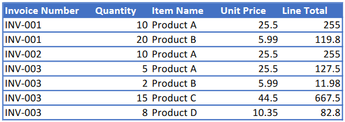

# Document Automation

Creation, conversion, and editing of complex text documents. This example shows filling invoice templates from spreadsheets of customer details and data. This process can be used to speed up internal processes, allowing one to focus on the decisions that really matter.

### Inputs ###

_Spreadsheet of customer details_

_Spreadsheet of product data_

_Invoice template (Word)_

### Outputs ###
Creates one invoice for each customer, filling in their purchases and calculating tax and totals. This can be modified to one's requirements.

